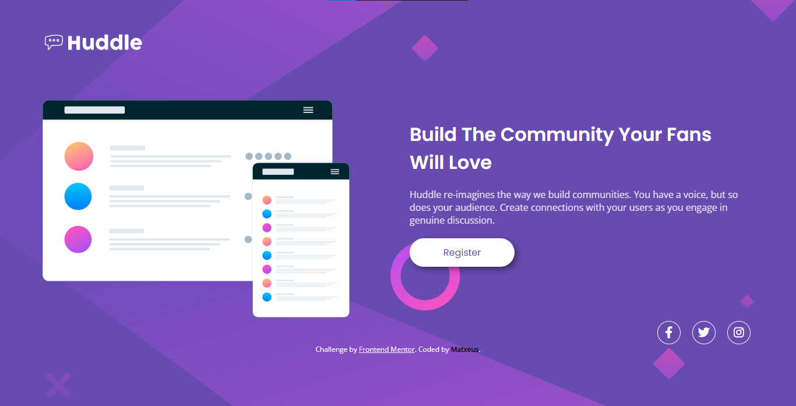

# Desafio do Frontend Mentor - Huddle landing page

O que usei para completar o desafio:

- HTML5 Semântico
- Variáveis CSS
- Flexbox
- CSS Grid

Dicas que me ajudaram a completar o desafio:

1. Look through the designs to start planning out how you'll tackle the project. This step is crucial to help you think ahead for CSS classes to create reusable styles.

2. Before adding any styles, structure your content with HTML. Writing your HTML first can help focus your attention on creating well-structured content.

3. Start adding styles to the top of the page and work down. Only move on to the next section once you're happy you've completed the area you're working on.

##Resultado do projeto (Desktop):
